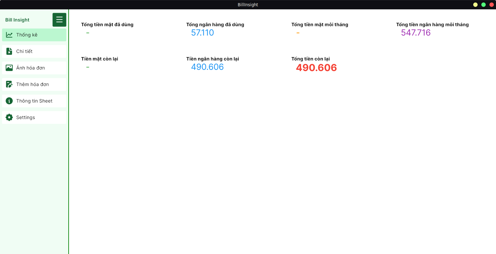
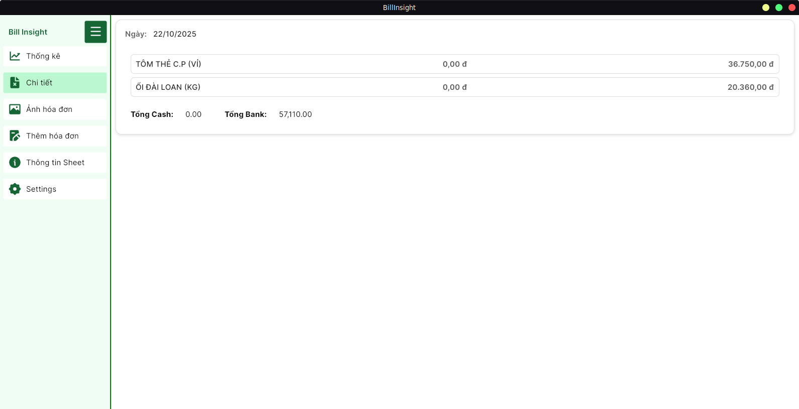
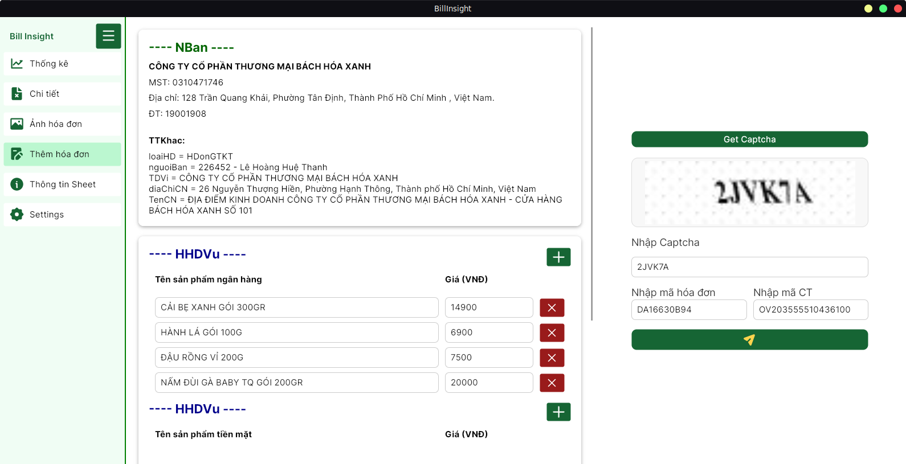
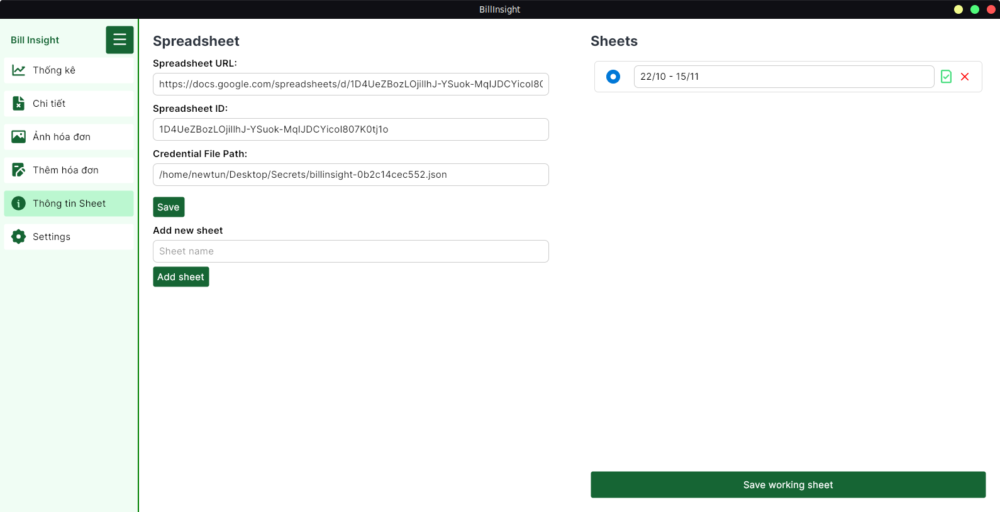

# BillInsight

BillInsight is a smart expense tracking tool that helps you manage your spending directly from Google Sheets.

---

## 🚀 Features

-   🔑 **Key Management**

    -   Import **service_account.json** file (Google Cloud credentials).
    -   Enter your **Google Spreadsheet ID**.

-   🧾 **Bill Management**
    -   Upload and save bill images.
    -   View total balance, spent amount, and remaining balance.
    -   View detailed bill information.
    -   Switch between multiple sheets.
    -   Use prebuilt **Sheet Templates** for easy setup.

---

## 🧩 Technologies Used

-   **Framework:** Avalonia
-   **Database & Automation:** Google Sheets API
-   **Authentication:** Google Cloud Service Account

---

## ⚙️ Setup Guide

### 1️⃣ Create a Project in Google Cloud Console

#### Step 1: Create a New Project

-   Go to [Google Cloud Console](https://console.cloud.google.com/).
-   Create a new project.

#### Step 2: Enable APIs

-   Navigate to **APIs & Services → Library**.
-   Enable **Google Sheets API** (and **Google Drive API** if needed).

#### Step 3: Authentication (Service Account)

-   Go to **APIs & Services → Credentials → Create Credentials → Service Account**.
-   Create and name your Service Account.
-   Download the **service_account.json** file.
-   Copy the Service Account email (e.g., `xxx@project-id.iam.gserviceaccount.com`).
-   Share your target Google Sheet with this email and grant **Editor** access.

#### GoogleSheet tempalte

-   [here](./docs/template/invoice_manager_template.xlsx)

---

## 💾 User Data

-   The credential JSON file (`service_account.json`) is stored **locally** on your device.
-   All configuration files are stored **locally** to ensure your data privacy.

---

## 🖼️ **Preview Screenshot:**

  
  

  
  

---

## 🧠 Future Improvements

-   OCR-based bill scanning
-   Multi-currency support
-   Expense category insights & charts
-   Mobile-friendly layout

---
